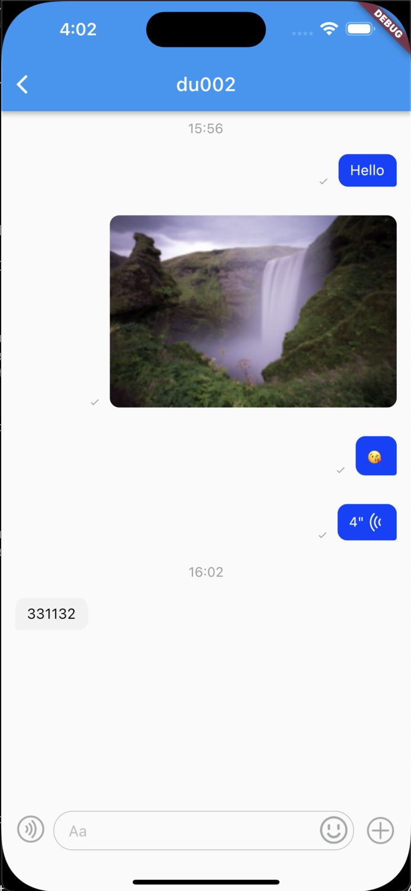
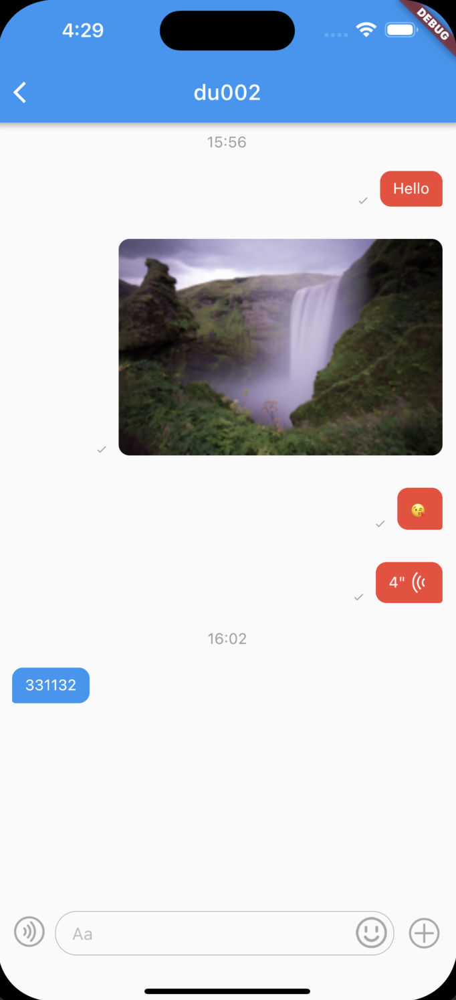
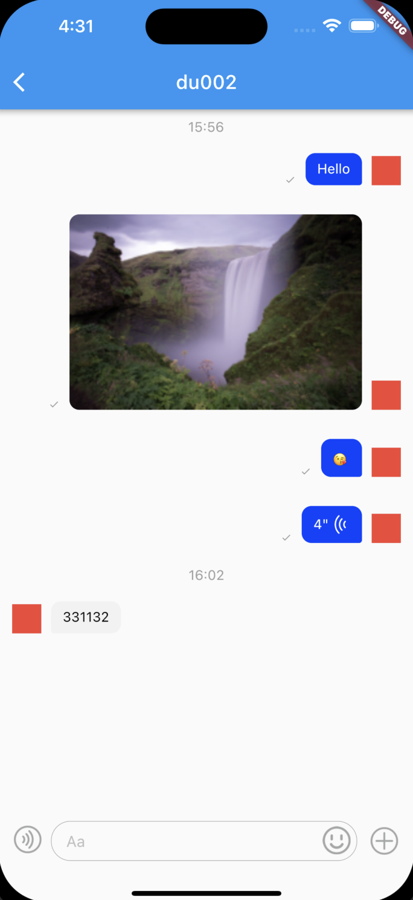
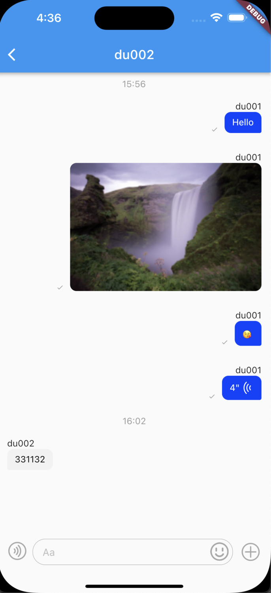
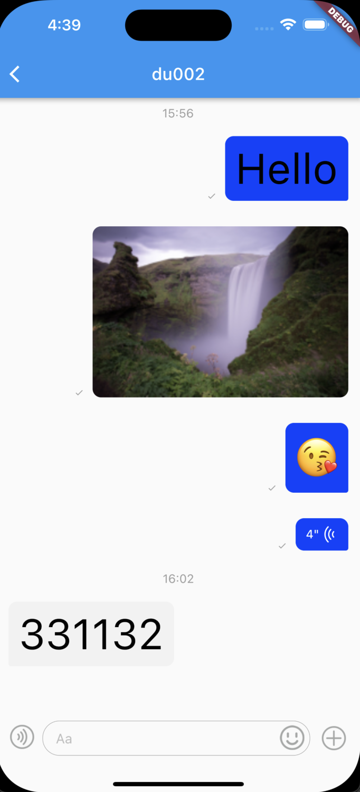
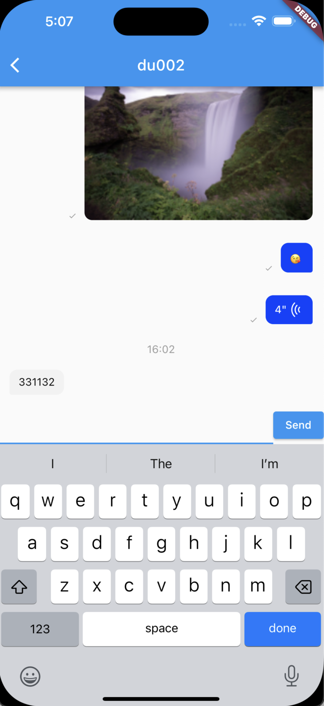
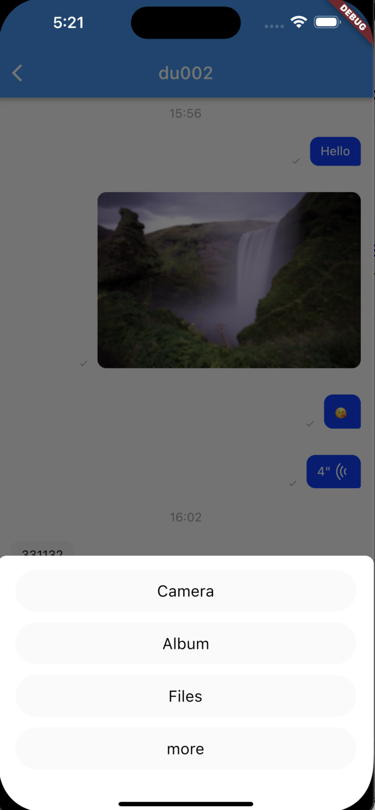

# Get Started with Agora Chat UIKit for Flutter

## Overview

Instant messaging connects people wherever they are and allows them to communicate with others in real time. With built-in user interfaces (UI) for the message list the [Agora Chat UI Samples]() enables you to quickly embed real-time messaging into your app without requiring extra effort on the UI.

This page shows a sample code to add peer-to-peer messaging into your app by using the Agora Chat UI Samples.
'agora_chat_uikit' currently has 2 modular widget:

`AgoraConversationsView` AgoraConversationsView is a conversation information page that displays existing conversation. And support for custom avatar and nickname operations.

`AgoraMessagesView` AgoraMessagesView is used to display message information, currently supports text, image, voice, and file messages. The profile avatar and nickname can be set through callbacks.

agora offers an open source agora_chat_uikit project on GitHub. You can clone and run the project or refer to the logic in it to create projects integrating agora_chat_uikit.

Source code URL of agora_chat_uikit for flutter:

* https://github.com/easemob/flutter_chat_uikit


## Function

The `agora_chat_uikit` library provides the following functions:

* Send and receive messages, message display, message unread count, clear messages, message types include: (text, picture, file, audio);
* Delete conversations and messages.
* Customize the UI.

<table>
  <tr>
    <td>Widget</td>
    <td>Function</td>
    <td>Description</td>
  </tr>
  <tr>
    <td> AgoraChatUIKit </td>
    <td></td>
    <td> The root of all widgets in AgoraChatUIKit. </td>
  </tr>
    <td rowspan="2"> AgoraConversationsView </td>
    <td> Conversation list </td>
    <td> The conversation list displays the profile avatar, nickname, latest message content, unread message count, and time </td>
  <tr>
    <td>Delete conversation</td>
    <td>Deletes the conversation from the conversation list.</td>
  </tr>
  <tr>
    <td rowspan="4">AgoraMessagesView</td>
    <td>Message sender</td>
    <td>Support to send text, emoji, picture, file, voice.</td>
  </tr>
  <tr>
    <td>Delete messages</td>
    <td>Delete messages</td>
  </tr>
  <tr>
    <td>Recall message</td>
    <td>Recall message in 120 seconds</td>
  </tr>
  <tr>
    <td>Display message</td>
    <td>Chat message display, including profile avatar, nickname, message content, time, sent status, and read status. Message types include text, picture, video, file, and voice</td>
  </tr>
</table>


## Dependencies

Some third party UI libraries are used in Agora_chat_uikit, as follows:

```dart
dependencies:
  agora_chat_sdk: 1.1.0
  image_picker: 0.8.6+4
  file_picker: 4.6.1
  record: 4.4.4
  audioplayers: 3.0.1
  common_utils: 2.1.0
```

## Permissions

### Android

```dart
<uses-permission android:name="android.permission.INTERNET" />
<uses-permission android:name="android.permission.ACCESS_NETWORK_STATE"/>
<uses-permission android:name="android.permission.WAKE_LOCK"/>
<uses-permission android:name="android.permission.READ_EXTERNAL_STORAGE"/>
<uses-permission android:name="android.permission.WRITE_EXTERNAL_STORAGE"/>
<uses-permission android:name="android.permission.CAMERA"/>
<uses-permission android:name="android.permission.RECORD_AUDIO"/>
```
### iOS

Open info.plist and add:

```
Privacy - Microphone Usage Description, and add a note in the Value column.
Privacy - Camera Usage Description, and add a note in the Value column.
Privacy - Photo Library Usage Description.
```

## Prevent code obfuscation

In the example/android/app/proguard-rules.pro file, add the following lines to prevent code obfuscation:
```
-keep class com.hyphenate.** {*;}
-dontwarn  com.hyphenate.**
```

## Getting started

Integrate uikit, which can be downloaded locally or integrated through git.


### pub.dev integration

```dart
flutter pub add agora_chat_uikit
flutter pub get
```

### Local integration

You can download the project to your computer and execute it.

```dart
dependencies:
    agora_chat_uikit:
        path: `<#uikit path#>`
```

## Usage

You need to make sure the agora chat sdk is initialized before calling AgoraChatUIKik and AgoraChatUIKit widget at the top of you widget tree. You can add it in the `MaterialApp` builder.

### AgoraChatUIKit

You must have a AgoraChatUIKit widget at the top of you widget tree.

|Props|Props Description|
--|--
theme| agora chat uikit theme for setting component styles. If not set, the default style will be used.

```dart
import 'package:agora_chat_uikit/agora_chat_uikit.dart';

class MyApp extends StatelessWidget {
  const MyApp({super.key});

  @override
  Widget build(BuildContext context) {
    return MaterialApp(
      title: 'Flutter Demo',
      theme: ThemeData(
        primarySwatch: Colors.blue,
      ),
      builder: (context, child){
        return AgoraChatUIKit(child: child!);
      },
      home: const MyHomePage(title: 'Flutter Demo'),
    );
  }
}
```

### AgoraConversationsView

The 'AgoraConversationsView' allows you to quickly display and manage the current conversations.

|Props|Props Description|
--|--
controller| The ScrollController for the conversation list.
itemBuilder| Conversation list item builder, return a widget if you need to customize it.
avatarBuilder| Avatar builder, if not implemented or returns null will use the default avatar.
nicknameBuilder| Nickname builder, which displays the userId if not set or null is returned.
onItemTap| Conversation list item Click event callback.


```dart
class _ConversationsPageState extends State<ConversationsPage> {
  @override
  Widget build(BuildContext context) {
    return Scaffold(
      appBar: AppBar(title: const Text("Conversations")),
      body: AgoraConversationsView(
        onItemTap: (conversation) {
          Navigator.of(context)
              .push(
                MaterialPageRoute(
                  builder: (ctx) => ChatPage(conversation),
                ),
              )
              .then((value) => AgoraChatUIKit.of(context)
                  .conversationsController
                  .loadAllConversations());
        },
      ),
    );
  }
}
```

For more information, see `AgoraConversationsView`

```dart
  const AgoraConversationsView({
    super.key,
    this.onItemTap,
    this.controller,
    this.reverse = false,
    this.primary,
    this.physics,
    this.shrinkWrap = false,
    this.padding,
    this.cacheExtent,
    this.dragStartBehavior = DragStartBehavior.down,
    this.keyboardDismissBehavior = ScrollViewKeyboardDismissBehavior.manual,
    this.restorationId,
    this.clipBehavior = Clip.hardEdge,
    this.itemBuilder,
    this.avatarBuilder,
    this.nicknameBuilder,
  });
```

### AgoraMessagesView

The `AgoraMessagesView` is used to manage and send and receive messages. It supports picture, text, voice, and file messages. It also supports operations such as deleting and recall messages.

|Props|Props Description|
--|--
inputBar| Text input component, if not passed by default will use [AgoraMessageInputWidget].
conversation| The conversation corresponding to the message details.
onTap| Message Bubble click event callback.
onBubbleLongPress| Message bubbles long press the event callback.
onBubbleDoubleTap| Message Bubble Double-click the event callback.
avatarBuilder| Avatar component builder.
nicknameBuilder| Nickname component builder.
itemBuilder| Message bubble, if not set, will take the default bubble.
moreItems| The more the input component clicks on the list displayed, the default items will be used if not passed in, including copy, delete, and recall.
messageListViewController| Message list controller: You are advised not to pass messages. Use the default value. For details, see [AgoraMessageListController].
willSendMessage| A pre-text message event that needs to return a ChatMessage object. that can be used for pre-text message processing.
onError| Error callbacks, such as no current permissions, etc.
enableScrollBar| Enable scroll bar, default is true.
needDismissInputWidget| Dismiss the input widget callback. If you use a customized inputBar, dismiss the inputBar when you receive the callback, for example, by calling [FocusNode.unfocus], see [AgoraMessageInputWidget].
inputBarMoreActionsOnTap| More button click after callback, need to return to the AgoraBottomSheetItems list.


```dart
class _ChatPageState extends State<ChatPage> {
  @override
  Widget build(BuildContext context) {
    return Scaffold(
      appBar: AppBar(title: Text(widget.conversation.id)),
      body: SafeArea(
        child: AgoraMessagesView(conversation: widget.conversation),
      ),
    );
  }
}

```

<div align=center> </div>

For more information, see `AgoraMessagesView`

```dart
  const AgoraMessagesView({
    super.key,
    this.inputBar,
    required this.conversation,
    this.onTap,
    this.onBubbleLongPress,
    this.onBubbleDoubleTap,
    this.avatarBuilder,
    this.nicknameBuilder,
    this.titleAvatarBuilder,
    this.moreItems,
    this.messageListViewController,
    this.willSendMessage,
  });
```


#### Customize colors

You can set the color when adding `AgoraChatUIKit`. See `AgoraChatUIKitTheme`.

```dart
class MyApp extends StatelessWidget {
  const MyApp({super.key});

  @override
  Widget build(BuildContext context) {
    return MaterialApp(
      title: 'Flutter Demo',
      theme: ThemeData(
        primarySwatch: Colors.blue,
      ),
      builder: (context, child) => AgoraChatUIKit(
        theme: AgoraChatUIKitTheme(
          sendBubbleColor: Colors.red,
          receiveBubbleColor: Colors.blue,
          sendTextStyle: const TextStyle(color: Colors.white),
          receiveTextStyle: const TextStyle(color: Colors.white),
        ),
        child: child!,
      ),
      home: const MyHomePage(title: 'Flutter Demo Home Page'),
    );
  }
}
```

<div align=center> </div>

#### Add avatar

```dart
class _MessagesPageState extends State<MessagesPage> {
  @override
  Widget build(BuildContext context) {
    return Scaffold(
      appBar: AppBar(title: Text(widget.conversation.id)),
      body: SafeArea(
        child: AgoraMessagesView(
          conversation: widget.conversation,
          avatarBuilder: (context, userId) {
            // Returns the avatar Widget that you want to display.
            return Container(
              width: 30,
              height: 30,
              color: Colors.red,
            );
          },
        ),
      ),
    );
  }
}
```

<div align=center> </div>


#### Add nickname

```dart
class _MessagesPageState extends State<MessagesPage> {
  @override
  Widget build(BuildContext context) {
    return Scaffold(
      appBar: AppBar(title: Text(widget.conversation.id)),
      body: SafeArea(
        child: AgoraMessagesView(
          conversation: widget.conversation,
          // Returns the nickname Widget that you want to display.
          nicknameBuilder: (context, userId) {
            return Text(userId);
          },
        ),
      ),
    );
  }
}
```

<div align=center> </div>


#### Add bubble click event

```dart
class _MessagesPageState extends State<MessagesPage> {
  @override
  Widget build(BuildContext context) {
    return Scaffold(
      appBar: AppBar(title: Text(widget.conversation.id)),
      body: SafeArea(
        child: AgoraMessagesView(
          conversation: widget.conversation,
          onTap: (context, message) {
            bubbleClicked(message);
            return true;
          },
        ),
      ),
    );
  }

  void bubbleClicked(ChatMessage message) {
    debugPrint('bubble clicked');
  }
}
```

### Custom message item widget

```dart
class _MessagesPageState extends State<MessagesPage> {
  @override
  Widget build(BuildContext context) {
    return Scaffold(
      appBar: AppBar(title: Text(widget.conversation.id)),
      body: SafeArea(
        child: AgoraMessagesView(
          conversation: widget.conversation,
          itemBuilder: (context, model) {
            if (model.message.body.type == MessageType.TXT) {
              return CustomTextItemWidget(
                model: model,
                onTap: (context, message) {
                  bubbleClicked(message);
                  return true;
                },
              );
            }
          },
        ),
      ),
    );
  }

  void bubbleClicked(ChatMessage message) {
    debugPrint('bubble clicked');
  }
}

class CustomTextItemWidget extends AgoraMessageListItem {
  const CustomTextItemWidget({super.key, required super.model, super.onTap});

  @override
  Widget build(BuildContext context) {
    ChatTextMessageBody body = model.message.body as ChatTextMessageBody;

    Widget content = Text(
      body.content,
      style: const TextStyle(
        color: Colors.black,
        fontSize: 50,
        fontWeight: FontWeight.w400,
      ),
    );
    return getBubbleWidget(content);
  }
}

```

<div align=center> </div>

### Customize the input widget

```dart
class _MessagesPageState extends State<MessagesPage> {
  late AgoraMessageListController _msgController;
  final TextEditingController _textController = TextEditingController();
  final FocusNode _focusNode = FocusNode();
  @override
  void initState() {
    super.initState();
    _msgController = AgoraMessageListController(widget.conversation);
  }

  @override
  void dispose() {
    _focusNode.dispose();
    super.dispose();
  }

  @override
  Widget build(BuildContext context) {
    return Scaffold(
      appBar: AppBar(title: Text(widget.conversation.id)),
      body: SafeArea(
        child: AgoraMessagesView(
          conversation: widget.conversation,
          messageListViewController: _msgController,
          inputBar: inputWidget(),
          needDismissInputWidget: () {
            _focusNode.unfocus();
          },
        ),
      ),
    );
  }

  Widget inputWidget() {
    return SizedBox(
      height: 50,
      child: Row(
        children: [
          Expanded(
            child: TextField(
              focusNode: _focusNode,
              controller: _textController,
            ),
          ),
          ElevatedButton(
              onPressed: () {
                final msg = ChatMessage.createTxtSendMessage(
                    targetId: widget.conversation.id,
                    content: _textController.text);
                _textController.text = '';
                _msgController.sendMessage(msg);
              },
              child: const Text('Send'))
        ],
      ),
    );
  }
}

```

<div align=center> </div>

### Delete all Messages in the current conversation

```dart
class _MessagesPageState extends State<MessagesPage> {
  late AgoraMessageListController _msgController;

  @override
  void initState() {
    super.initState();
    _msgController = AgoraMessageListController(widget.conversation);
  }

  @override
  Widget build(BuildContext context) {
    return Scaffold(
      appBar: AppBar(
        title: Text(widget.conversation.id),
        actions: [
          TextButton(
              onPressed: () {
                _msgController.deleteAllMessages();
              },
              child: const Text(
                'Clear',
                style: TextStyle(color: Colors.white),
              ))
        ],
      ),
      body: SafeArea(
        child: AgoraMessagesView(
          conversation: widget.conversation,
          messageListViewController: _msgController,
        ),
      ),
    );
  }
}
```

### Customize input bar more actions

```dart
class _MessagesPageState extends State<MessagesPage> {
  @override
  void initState() {
    super.initState();
  }

  @override
  Widget build(BuildContext context) {
    return Scaffold(
      appBar: AppBar(
        title: Text(widget.conversation.id),
      ),
      body: SafeArea(
        child: AgoraMessagesView(
          conversation: widget.conversation,
          inputBarMoreActionsOnTap: (items) {
            AgoraBottomSheetItem item =
                AgoraBottomSheetItem('more', onTap: customMoreAction);

            return items + [item];
          },
        ),
      ),
    );
  }

  void customMoreAction() {
    debugPrint('custom action');
    Navigator.of(context).pop();
  }
}
```

<div align=center> </div>


## example

See the example for the effect.

### quick start

If demo is required, configure the following information in the `example/lib/main.dart` file:

// Replaces <#Your app key#>, <#Your created user#>, and <#User Token#> and with your own App Key, user ID, and user token generated in Agora Console.

```dart
class AgoraChatConfig {
  static String appkey = <#Your app key#>;
  static String userId = <#Your created user#>;
  static String agoraToken = <#User Token#>;
}
```

## License

The sample projects are under the MIT license.